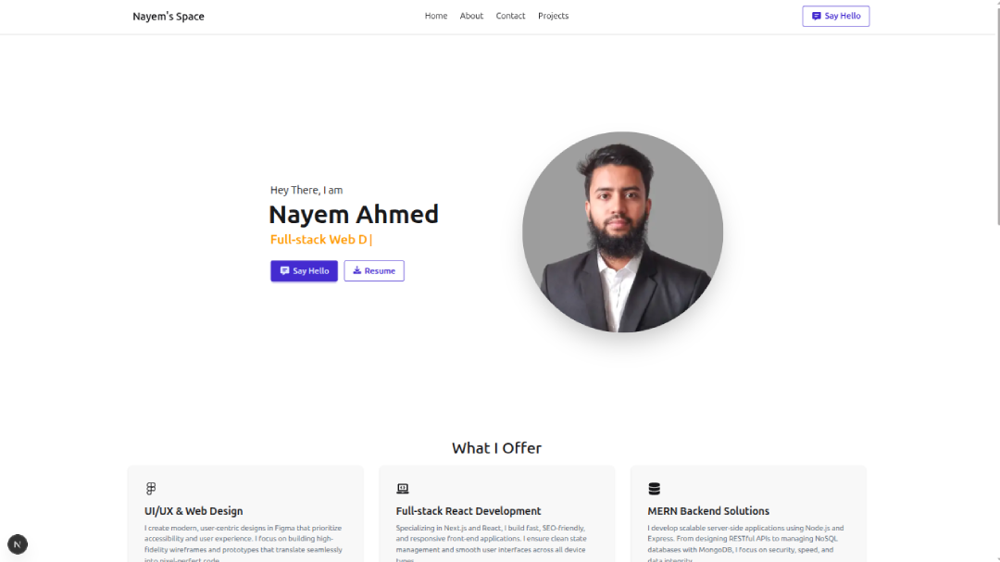

# Nayem's Space
A portfolio website of Nayem Ahmed

## Overview
Hi, I am **Nayem Ahmed**, a passionate Computer Science and Engineering student with a strong foundation in web development (MERN stack)
and expertise in data science and machine learning. This portfolio showcases some of my best work and demonstrates my skills in web development.

You can visit my Portffolio live here: [Nayem Ahmed's Portfolio](https://nayem-ahmed.vercel.app/);

## Technology used
- Next Js
- TailwindCSS and DaisyUI
- TypeScript
- HTML

## Tools and Libraries
- react-icons
- react-simple-typewriter
- motion : for animation

## Features
- A dynamic and fully responsive layout.
- Showcases various projects, skills, and a resume download link.
- Contact form for direct communication.
- Animations and transitions for better user experience.

## Project Timeline
- Initially Created on: 6 September 2024
Converted on
- React App: 1 November 2024 (vite/23-Feb-2025)
- Next Js App: 5 Dec 2024
- Last updated on: 5 Dec 2024

## Version History
- **v3.0.0 (Dec 2025)** – Moved to Next Js, used TypeScript
- **v2.2.1 (Oct 2025)** – Updated routes, solved image loadin issue and added 2 React Js Projects
- **v2.2.0 (Oct 2025)** – Updated route using React Router Data mode, redefined project strucutre, added sort method on project page
- **v2.1.0 (Sep 2025)** – Updated Profile, Modal on Project section, animation before image loads, redefined grid-based project layout
- **v2.0.0 (Aug 2025)** – Added dark mode and Redefine UI
- **v1.7.0 (Feb 2025)** – Moved on Vite from CRA 
- **v1.5.0 (Nov 2024)** – Converted into React App
- **v1.0.0 (Sep 2024)** – Initial release

## Contact Me
If you would like to get in touch, feel free to connect via:
+ Email : nayemahmedz@proton.me 
+ Linkedin : www.linkedin.com/in/nayem-ahmedz
+ Github : https://github.com/nayem-ahmedz/